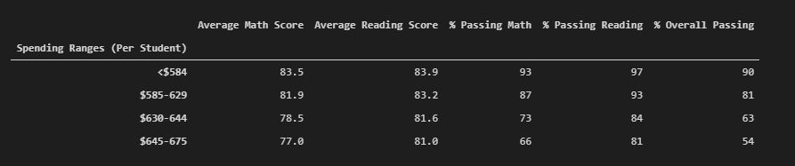
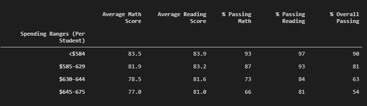
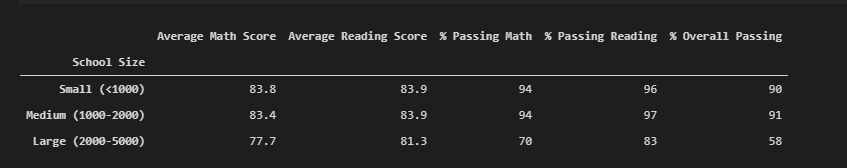
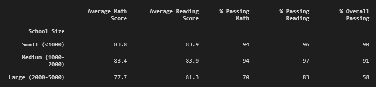
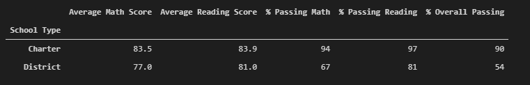
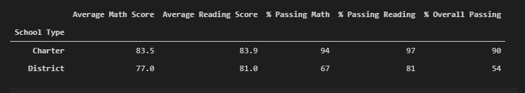

# School Distrcit Analysis
## Purpose of the Analysis
This analysis was performed to determine how school size, budget per student, and school type (district or charter) affect standardized testing scores and overall pass rates for high school students. The analysis was refactored and re-run after learning potential miscounduct may have resulted in inaccurate scores for the 9th grade student body of one of the high schools included in the analysis. The test scores of the 9th grade class in question were removed from the analysis.

## Results
#### Changes to District Summary
- The district summary was not materially affected by removing the questionble scores. 
- The score most affected at the district level was the percentage of students who passed the reading portion of the test. This number fell to 85.7% from 86%. 
- The overall passing percentage for the district remained at a rounded 65%. 

#### Changes to the School Summary
- Removing the scores also did not affect Thomas High School's overall ranking within the district. 
- The overall passing percent for the remaining grades (10-12) was still high enough to keep Thomas High School as the second best performing school in the district with an overall passing percentage of 91%.

#### Scores by Grade Review
- For Thomas High School, the school in which test scores may have been affected, the scores by grade were not changed beyond the removal of the 9th grade scores. 

#### Scores by Spending Review
- Scores by school spending per student were unaffected by the chnages in the data. 

#### Scores by School Size Review
- Pass rates based on school size were also unaffected by the changes in the data.

#### Scores by School Type Review
- Pass rates based on the typ of school, charter vs. district were also unaffected by the changes in the data. 

### Summary
The analysis was not significantly impacted by removing the scores of the Thomas High School ninth grade class.